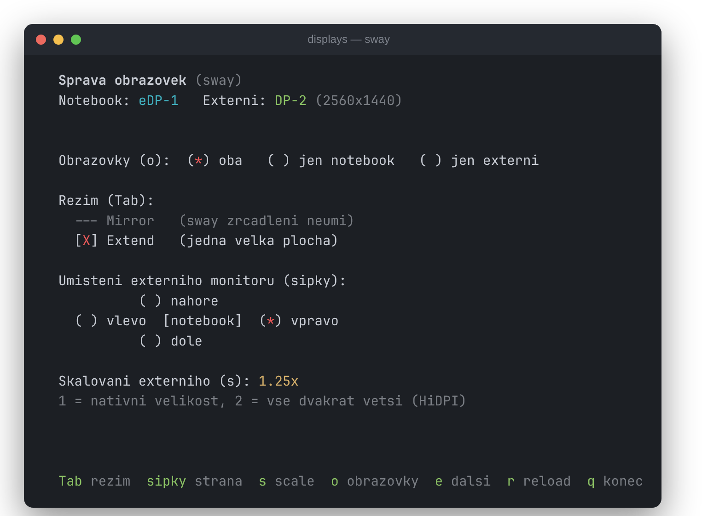
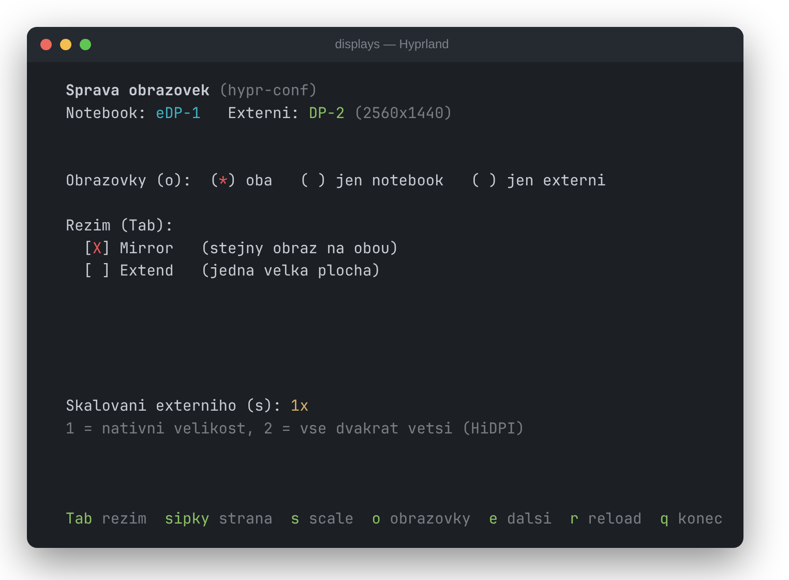

# displays

Terminal UI for managing external monitor layout on **Sway** and **Hyprland** — extend/mirror, side, scale, on/off, all with live preview and a keypress.

[](https://swaywm.org/)
[](https://www.gnu.org/software/bash/)
[](https://opensource.org/license/MIT)
[](https://github.com/Luquas95/displays)



<details>
<summary>On Hyprland, where Mirror is available</summary>



</details>

## What it does

- **Extend / Mirror** — toggle between one big desktop and a mirrored image (Mirror on Hyprland only, see below)
- **Placement** — put the external monitor left, right, above or below the laptop panel
- **Scale** — cycle 1 / 1.25 / 1.5 / 2, auto-snapped to the nearest value the compositor will actually accept for that resolution
- **Outputs** — both screens, laptop only, or external only
- **Multiple externals** — cycle between them with `e` if more than one is connected
- **Persistence** — the last layout you pick survives a compositor restart or the laptop being unplugged and replugged, instead of resetting to the default rule every time

Nothing is applied until you press a key — starting the program just shows the current state.

## Supported compositors

The backend is detected automatically at startup and shown in the header.

| Backend | Detected when | Live changes | Saved layout |
|---------|---------------|--------------|--------------|
| `sway` | `$SWAYSOCK` is set and `swaymsg` answers | `swaymsg output …` | `~/.local/state/displays/outputs.conf`, `include`d from `~/.config/sway/config` |
| `hypr-lua` | `hyprctl` works and `~/.config/hypr/hyprland.lua` exists (Omarchy 4 "Quattro" and newer) | `hyprctl eval` with `hl.monitor{…}` | `~/.local/state/omarchy/displays/monitors.lua`, `dofile`d from `hyprland.lua` |
| `hypr-conf` | `hyprctl` works, classic `hyprland.conf` | `hyprctl keyword monitor` | `~/.local/state/omarchy/displays/monitors.conf`, `source`d from `hyprland.conf` |

Adding a backend means implementing one group of functions (`wm_monitors_json`, a `*_rule_cmd` translator, `wm_flush`, `wm_reload` and a `wire_*`); everything above it — output detection, layout math, scale snapping and the TUI — is shared.

### Sway caveat: no mirroring

Sway cannot mirror, and there is no workaround inside the compositor. Every workspace belongs to exactly one output (see the `output` field in `swaymsg -t get_workspaces`), so two outputs can never show the same content. Placing outputs at overlapping coordinates does **not** mirror them — it just makes them fight over the same coordinate space.

So on the `sway` backend Mirror is disabled: the mode line shows it greyed out and `Tab` explains why instead of switching. Everything else — placement, scale, outputs, persistence — works the same as on Hyprland.

If you need a mirror on Sway, run [`wl-mirror`](https://github.com/Ferdi265/wl-mirror) (packaged in Arch `extra`) next to this tool:

```bash
wl-mirror --fullscreen-output DP-2 eDP-1   # show eDP-1 fullscreen on DP-2
```

Use `displays` to place and scale the output first, then point `wl-mirror` at it.

## Requirements

- Sway (`swaymsg`) **or** Hyprland (`hyprctl`)
- `jq`

## Installation

```bash
cp displays ~/.local/bin/
chmod +x ~/.local/bin/displays
```

(assumes `~/.local/bin` is on `$PATH`)

## Usage

```bash
displays
```

| Key | Action |
|-----|--------|
| `Tab` | Switch mode — Mirror ↔ Extend |
| `←` `→` `↑` `↓` | In Extend: side of the external monitor relative to the laptop |
| `s` | Cycle external monitor scale (1 / 1.25 / 1.5 / 2) |
| `o` | Which screens are on — both / laptop only / external only |
| `e` | Switch to the next external monitor (when more than one is connected) |
| `r` | Reset to the defaults in your compositor config (forgets the saved layout below) |
| `q` | Quit |

## How persistence works

Every applied change is written to a state file (see the table above). On its first run, `displays` wires that file into your compositor config for you — on Sway an `include` appended at the end of `~/.config/sway/config`, on Hyprland right after the existing `monitors.conf` / `require("hypr.monitors")` line — so it takes priority over the defaults, and it backs the config up beforehand (`*.bak.<timestamp>`). No manual config editing needed, even on a fresh machine. That means your last choice always wins on the next compositor start — without it, reconnecting a monitor falls back to the static default rule (typically "place it to the right"), no matter what you had set before.

## Why not just edit the config by hand?

You can, but you're guessing coordinates and scale values the compositor will silently adjust if they don't divide evenly into whole pixels. `displays` reads the real state back from the compositor, computes positions itself so the layout is always anchored with no gaps, and snaps scale to a value that survives — all with instant visual feedback instead of a reload-and-check loop.

## Contributors

- [Luquas95](https://github.com/Luquas95) — creator & maintainer
